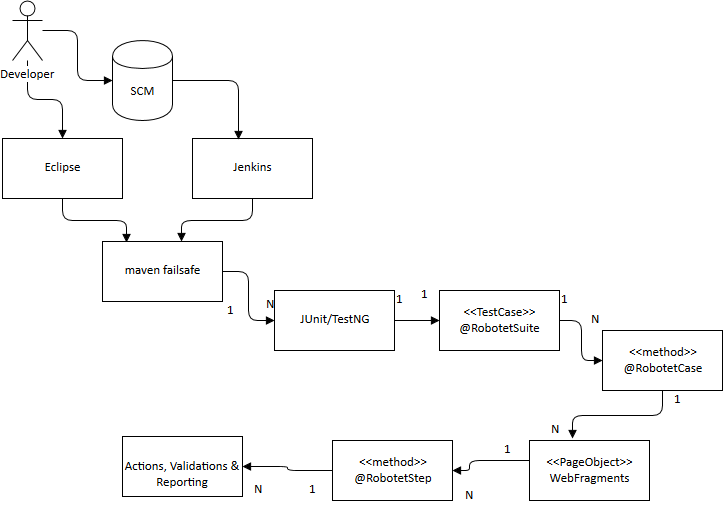
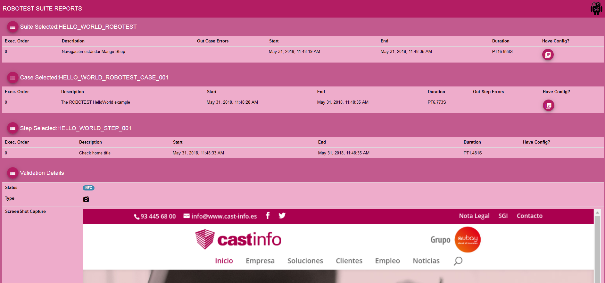
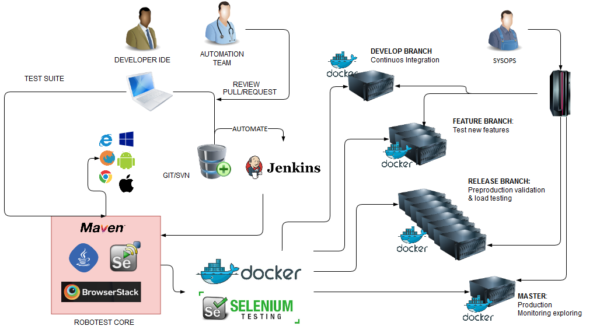

# ROBOTEST

**PROJECT UNDER CONSTRUCTION, NOT PRODUCTION READY**


- [INTRODUCTION](#introduction)
- [VERSION 2 MOTIVATION](#version-2-motivation)
- [SELENIUM](#selenium)
- [DOCKER](#docker)
- [API REST TESTING (API TESTING)](#api-rest-testing--api-testing-)
- [BROWSERSTACK](#browserstack)
- [COMPATIBILITY MATRIX](#compatibility-matrix)
- [REQUIREMENTS](#requirements)
- [HELLO WORLD MAVEN PROJECT](#hello-world-maven-project)
  * [Download and build ROBOTEST](#download-and-build-robotest)
  * [Integrate ROBOTEST under existing project](#integrate-robotest-under-existing-project)
    + [With B.O.M.](#with-bom)
    + [Without B.O.M.](#without-bom)
  * [Creating an isolated project](#creating-an-isolated-project)
  * [Profile activation](#profile-activation)
  * [Failsafe plugin](#failsafe-plugin)
  * [Resolving MAVEN conflicts](#resolving-maven-conflicts)
- [HELLO WORLD JAVA CODE](#hello-world-java-code)
  * [Previous consideration: ROBOTEST organization levels](#previous-consideration--robotest-organization-levels)
  * [Suite Object with implemented Cases](#suite-object-with-implemented-cases)
    + [Suite/Case Implementation elements](#suite-case-implementation-elements)
  * [The PageObject with steps and validations.](#the-pageobject-with-steps-and-validations)
    + [Suite/Case Implementation elements](#suite-case-implementation-elements-1)
- [HELLO WORLD CONFIGURATION](#hello-world-configuration)
  * [Basic configuration defined in Java System Properties](#basic-configuration-defined-in-java-system-properties)
  * [Suite, Case & Step annotaded extended configuration](#suite--case---step-annotaded-extended-configuration)
- [RUN THE HELLO WORLD EXAMPLE](#run-the-hello-world-example)
  * [Debug Failsafe](#debug-failsafe)
- [EXTENDED REPORT](#extended-report)
- [E2E TESTS DEVELOPEMENT RECOMENDATIONS](#e2e-tests-developement-recomendations)
- [JENKINS INTEGRATION](#jenkins-integration)
- [ROBOTEST DEVELOPEMENT INVOLVING REQUIREMENTS AND CODING RULES](#robotest-developement-involving-requirements-and-coding-rules)
- [ROADMAP](#roadmap)
- [ABOUT](#about)

# INTRODUCTION

ROBOTEST is a **OpenSource Automation End2End and REST API Test Engine**.

It's based on **Java**, **Selenium** and **RestAssured** projects.

The target is simplify integration Test development with **JUnit or TestNG** frameworks under **[Maven Failsafe](http://maven.apache.org/surefire/maven-failsafe-plugin/)** launcher to provide **parametrization and parallelism** capacities. 

We develop **three kind of browsers** around the execution environment:

- **Workstation**: To develop and debug Test.
- **Docker**: In Jenkins, to provide Continuous Integration in *NIX systems to avoid headless. Can be debug in developer workstation.
- **https://www.browserstack.com**: To provide iOs, Android, or other desktop or mobile platforms that supports this great service for native or browser E2E testing.

# VERSION 2 MOTIVATION

ROBOTEST was a degree of final project Jorge Muñoz, team member of Cast-Info company. 

The project has been managed as a service in our clients by Jorge Muñoz.

We keep a version of ROBOTEST 1.0 for years, but in recent years we have had to do a great refactoring of ROBOTEST because of the new challenges:

- Do end2end testing by team developers: QA as a service fails, do not scale and the programmers are the best actors to develop and maintain tests (unit testing, api testing and e2e tests).
- Continuos Integration: headless execution in *NIX systems without Desktop. 
- OpenSource project
- Continue with parallelism ROBOTEST 1.0 capacities, but redesign to simplify and reset years of technical debt caused by client adaptations and technology evolution.
- PageObject pattern and partial suite execution concepts, in mind.
- Provide a new reporting tool based on angular 2+
- Extra ball: API REST tests tools and configuration utilities.

The new project was developed by the CAST-INFO team:

- [Jorge Muñoz](https://github.com/Jorge2M)
- [Jordi Artal](https://github.com/jordiartal)
- [Miguel Ruiz](https://github.com/ruicapmi)

And the support of the CAST-INFO leaders and their clients. 

# SELENIUM

ROBOTEST **simplify the interaction with all elements of Selenium ecosystem** in E2E tests.

- JUnit/TestNG: ROBOTEST implements the necessary listeners to do correct integration with this frameworks.
- [Selenium API](https://github.com/SeleniumHQ/selenium): ROBOTEST provides access to the WebDriver API to develop tests and has implemented its usual uses, encapsulating them, but the use of these wrappers is not mandatory, you can develop your own utilities or contribute to this project :)
- [Web Driver Manager](https://github.com/bonigarcia/webdrivermanager) The interaction between the Selenium API and the browser is complete with a native implementation of the driver that implements the W3C WebDriver protocol. Thanks to this integration, ROBOTEST delegates the download of the latest version of the native driver at run time. It depends on the installed browser version, you can have old versions of native drivers.
- Browsers:
  - Workstation: developer uses is own version that must be correlated with the native driver to E2E with or without (headless) browser UI. 
  - [Docker Selenium](https://github.com/SeleniumHQ/docker-selenium): In this types of test, ROBOTEST loads the docker image hub correlated with Selenium API version and execute inside container the test, with or without (headless) 
  - https://www.browserstack.com: we do a correct correlation with this browser automation backend and Selenium API version.

**ROBOTEST, by default, uses lastest versions of Selenium API - Native Driver - Browser** if not selected. With chorme this strategy works fine but firefox is doing a great transformation and native Gecko driver isn't completed. In the future we will work to do a compatibility matrix of this correlation and make posible automatization of this issues to maximize and simplify compatibilities.

# DOCKER

We use **[Selenium official image Docker for firefox & chrome](https://github.com/SeleniumHQ/docker-selenium)** with this important considerations:

- ROBOTEST don't have control of installation and startup of Docker target machine, you must provide and start this element.
- ROBOTEST do automatic pull of tag images configured, to be installed in docker machine.
- ROBOTEST do automatic creation and startup, stop and remove container image
- ROBOTEST do automatic destroy and remove of container at the tests end. In unexpected ended breaked tests you must do a manual remove of this orphan instances. We are working to automate this.

This type of tests are carried out with the **Remote Web Selenium Driver** because the Docker images load a HUB. 

Debug executing Docker HUB Selenium Browser is posible. Select ROBOTEST Docker debug basic config options to do habitual IDE debuging operations. To visualize Docker browser in action connect with a remote X viewer (VNC Viewer, e.g.) to the docker machine configured IP and do "docker ps" or "docker inspect $image_id" to view real open ports (mapped with 5900 debug default configured port, but not exposed and random assigned real port).


# API REST TESTING (API TESTING)

ROBOTEST **integrates RestAssured API Testing tool, available in your PageObjects and TestCases**.  

https://github.com/rest-assured/rest-assured/wiki/GettingStarted

https://github.com/rest-assured/rest-assured/wiki/Usage

**REST Request and Response have 3 common validations: Message structures, types and data values**. We recommend to explode RestAssured capacities of request & response spec and validations utilities: 
- Prototype and Message structure with POJO auto-mapping marshall/unmarshall JSON and XML based in Jackson and JAXB.
- Assertions of the business logic of POJO mapped data with included RestAssured assertion API's or else JUnit, TestNG, etc.
- XPath and JSONPath value validations of JSON, XML or HTML.

To enforce this we try to develop a wrapper (com.castinfo.devops.robotest.restassured.RestAssuredWrapper). To see examples of use we develop test examples in ROBOTEST core (com.castinfo.devops.robotest.restassured.RestTest)

XML Schema and JSON Schema can generate mapping POJO's for auto mapping. You can do:

- To generate JSON mapping POJO's: Obtain example JSON request or response and generate and improve JSONSchema with tools you like (e.g. https://jsonschema.net), then, use jsonschema2pojo-maven-plugin (https://github.com/joelittlejohn/jsonschema2pojo) to generate Jackson classes compatibles with RestAssured.

- To generate XML mapping POJO's: Obtain example XML request or response and generate and improve XSD with "Venetian Blind" style with tools you like (e.g. https://www.freeformatter.com/xsd-generator.html, etc). Use generated schema with your prefered tool like eclipse o with jaxb2-maven-plugin:xjc to obtain Jackson mapping pojos.  
    
# BROWSERSTACK

This type of test requires a valid user name and access key.

We recommend real mobile Android and iOs but other browsers are available. 

https://www.browserstack.com/list-of-browsers-and-platforms?product=automate

# COMPATIBILITY MATRIX

WEBDRIVER CHROMEDRIVER: https://chromedriver.storage.googleapis.com

WEBDRIVER GECKO FIREFOX: https://api.github.com/repos/mozilla/geckodriver/releases

WEBDRIVER IE: https://selenium-release.storage.googleapis.com

SELENIUM DRIVER RELEASES: https://github.com/SeleniumHQ/selenium/releases

DOCKER SELENIUM RELEASES: https://github.com/SeleniumHQ/docker-selenium/releases


| BROWSER | BROWSER_VERSION | WEBDRIVER | SELENIUM_DRIVER | DOCKER_IMG                                                 | HEADLESS CAPABILITY |
|---------|-----------------|-----------|-----------------|------------------------------------------------------------|---------------------|
| IE      | 7-11            | 2.39      | 3.11.0          |                                                            |                     |  
| IE      | 59.+            | 0.20.0    | 3.11.0          |                                                            |                     |
| FIREFOX | 59.+            | 0.20.1    | 3.11.0          | `selenium/standalone-firefox:3.11.0-dysprosium`            | yes                 |
| FIREFOX | 59.+            | 0.20.0    | 3.11.0          | `selenium/standalone-firefox:3.11.0-(bismuth/californium)` | yes                 |
| CHROME  | 66.0.+          | 2.38      | 3.11.0          | `selenium/standalone-chrome:3.11.0-dysprosium`             | yes                 |
| CHROME  | 65.0.+          | 2.37      | 3.11.0          | `selenium/standalone-chrome:3.11.0-(bismuth/californium)`  | yes                 |

# REQUIREMENTS

ROBOTEST was developed in Eclipse Mars, Neon and Oxigen Releases in a Windows 7 and 10 i5 and i7 laptops with at least 8gb of RAM. 

To **run** ROBOTEST you need at least:

* Java 1.8.+
* Maven 3+  
* Docker 17.07.0-ce (Only if you need run browser in Docker. We use https://github.com/docker-java/docker-java/ that suports Docker Remote API v1.23, Docker Server version 1.11.x)
* A https://www.browserstack.com/ account if you try it.

To **build** ROBOTEST you need too:

* binaries of Graphviz 2.27 in PATH to generate UML with JavaDoc in MAVEN if you wan't to build ROBOTEST core
* node.js and npm installed and in PATH to build ROBOTEST suite reporting tool 

# HELLO WORLD MAVEN PROJECT

## Download and build ROBOTEST

**We are working to distribute the project in the Sonatype OSS repository, but now you need to download it and install it in your local .m2 repository or deploy it in your own proxy repository**

After download master branch of project, execute *mvn install* in this modules in this order:

bom
core
suite-cases-json-generator
standalone-suite-report-ui (first time, execute with `-PinstallTooling` profile to install needed npm global libs, and remember that node and npm must be in PATH)
examples-basic (If you need to play with the examples).

## Integrate ROBOTEST under existing project

### With B.O.M. 

MAVEN **Bill of Materials** parent POM is the simplest way to start ROBOTEST integration

1) put this parent in your pom.xml:
    
```xml
    <parent>
        <groupId>com.cast-info.devops.robotest</groupId>
        <artifactId>robotest-bom</artifactId>
        <version>${robotest.version}</version>
    </parent>
```
2) Overwrite some properties defined (and explained) in the B.O.M. **REBOTEST default values uses local CHROME browser without Docker, with 3 parallel method cases with his own isolated browser**.

```xml
    <properties>
        <robotest.cfg.headless>false</robotest.cfg.headless>
        <robotest.cfg.browser.name>CHROME</robotest.cfg.browser.name>
        <robotest.cfg.docker.conn>tcp://192.168.99.100:2376</robotest.cfg.docker.conn>
        <robotest.cfg.docker.tls>true</robotest.cfg.docker.tls>
        <robotest.cfg.docker.public_host>192.168.99.100</robotest.cfg.docker.public_host>    
    </properties>
```

### Without B.O.M.

If your project already uses a parent that blocks the possibility to use ROBOTEST B.O.M. you can *copy/add* in your project this sections of our B.O.M.:

1) properties
2) dependencyManagement
3) profiles: robotestRun and withJUnit/withTestNG (select the framework you want)

## Creating an isolated project

If any MAVEN integration is impossible by different causes (e.g. Java version) you can create an isolated independent project to develop with ROBOTEST. 

In this case, we recommend you use ROBOTEST B.O.M. definition in your project.  

## Profile activation

You can activate passing mvn CLI `-ProbotestRun` parameter or put void file `robotest.run.junit.profile.activator` or `robotest.run.testng.profile.activator` for simplify activation

## Failsafe plugin

E2E and API REST tests are **Integration Tests**. MAVEN provides an alternative to surefire plugin (with same features) to isolate this kind of tests: [failsafe](http://maven.apache.org/surefire/maven-failsafe-plugin/). ROBOTEST MAVEN profiles includes and configures defaults of this plugin:

- Creates src/integration-test/java and src/integration/resources with build-helper-maven-plugin
- Execution of all test with the pattern IT*.java finded in src/integration-test/java

The main diference beetwen failsafe and surfire is: **you don't have your project main sources in the failsafe execution classpath**. It's logic, are integration test ;)

## Resolving MAVEN conflicts

Properties, dependencies and plugins of ROBOTEST in your project will be merged by MAVEN system.

Revise with e.g. in Eclipse with "Effective POM" and "Dependency Hierachy" view, if some propertie or dependency resolved is convenient for your project. 

ROBOTEST core will be placed under scope test, but revise if you have some conflict around transitive dependencies.

Remember that this dependencies and plugins can be adjusted for your own project target configuration compatibility but may be cause some issues to ROBOTEST.    

# HELLO WORLD JAVA CODE

## Previous consideration: ROBOTEST organization levels and components

Unit testing frameworks defines 3 organization levels: Suites, Cases of a suite, and Validations of case.

In our experience in browser automation E2E testing, we take dessign decision to organize ROBOTEST in 4 levels: Suites, Cases of suite, Steps of case and Validations of step.

The work of ROBOTEST is adapt execution of the new levels inside JUnit/TestNG frameworks, and generate and alternative report to reflect this **4 levels to improve review**.

You can see component vs level organization in this simple graph:



## Suite Object with implemented Cases

Firts step after maven project configuration is create Suite Object with cases: 

```Java
package com.castinfo.devops.robotest.examples;

import java.util.Properties;

import org.junit.Test;
import org.junit.runner.RunWith;

import com.castinfo.devops.robotest.RobotestException;
import com.castinfo.devops.robotest.TestCase;
import com.castinfo.devops.robotest.annot.RobotestCase;
import com.castinfo.devops.robotest.annot.RobotestConfig;
import com.castinfo.devops.robotest.annot.RobotestSuite;
import com.castinfo.devops.robotest.junit.JUnitCaseRunner;

@RobotestSuite(tag = "HELLO_WORLD_ROBOTEST",
               description = "Navegación estándar Mango Shop",
               configElements = { @RobotestConfig(key = "WEB_TO_TEST",
                                                  type = Properties.class,
                                                  resource = "system://CAST-INFO-WEB") })
@RunWith(JUnitCaseRunner.class)
public class ITHelloWorld extends TestCase {

    @Test
    @RobotestCase(tag = "HELLO_WORLD_ROBOTEST_CASE_001", description = "The ROBOTEST HelloWorld example")
    public void helloWorld() throws RobotestException {
        HelloWorldPageObject helloWorldPO = this.buildPageObject(HelloWorldPageObject.class);
        String urlToTest = this.getSuiteTestPropertyCfg("WEB_TO_TEST", "CAST-INFO-WEB"); //Or System.getProperty("CAST-INFO-WEB"); 
        helloWorldPO.openURL(urlToTest);
        helloWorldPO.checkTitle();
    }

}
```

### Suite/Case Implementation elements

`@RobotestSuite`: JUnit/TestNG classes must be annotated with this tag and extends TestCase ROBOTEST API class to be ROBOTEST identified and managed. ROBOTEST creates isolated context associated to this annotation, to be Thread Safe and provide context execution for the other levels defined. This context is loaded with the necessary elements of ROBOTEST (Selenium WebDriver, Docker instances, Report, etc) to be accesible.

`TestCase` extended classes: The class to implement @Test JUnit or TestNG cases.  

`@RobotestCase`: @Test JUnit/TestNG method must be annotaded with this tag to maintain ROBOTEST associated execution context. This class can load Page Objects to load this associated execution context.

## The PageObject with steps and validations. 

```Java
package com.castinfo.devops.robotest.examples;

import com.castinfo.devops.robotest.PageObject;
import com.castinfo.devops.robotest.RobotestException;
import com.castinfo.devops.robotest.annot.RobotestStep;

public class HelloWorldPageObject extends PageObject {

    @RobotestStep(tag = "HELLO_WORLD_STEP_001", description = "Check home title")
    public void checkTitle() throws RobotestException {
        String parameter = "Cast Info | Cast Info s.a > Soluciones y Servicios tecnológicos de Vanguardia";
        if (!parameter.equals(this.getDriver().getTitle())) {
            throw new RobotestException("Screen doesn't contains this Title: " + parameter);
        }
        this.addInfoToReport().withMessage("Hi! you complete your first Hello World ROBOTEST example");
    }

}

```

### Suite/Case Implementation elements

`PageObject` extended classes: Outside JUnit/TestNG classes, developer can develop Page Objects extending PageObject class, to implement steps in methods of this class. 

`@RobotestStep`: All steps of ROBOTEST Page Object must be created in methods of this class and annotated with this tag. ROBOTEST load the necessary elements of context to be developer accessible (WebDriver & Report), and wraps utility methods accessible by developer to do habitual e2e testing script.

Validations: Validations are Assertions with the Selenium API browser information available, under step or case you can do programmatic validations with the JUnit/TestNG provided tools and report the results. ROBOTEST implements utilities like screen shoot, page source o console logs and provide report methods in your Page Object implementation to add to the report. Some of this can be do it with simple @RobotestStep annotation attributes.

# HELLO WORLD CONFIGURATION

ROBOTEST do a great job to enforzes parametrization, with Continuous Integration in mind, and in our testing developer experience.

ROBOTEST has **2 different kinds of configuration**:

## Basic configuration defined in Java System Properties

Through failsafe, rewrite failsafe plugin in your build plugins section:

```xml
    <build>
        <plugins>
            <plugin>
                <groupId>org.apache.maven.plugins</groupId>
                <artifactId>maven-failsafe-plugin</artifactId>
                <!-- you don't need to indicate version, inherited from B.O.M. -->
                <executions>
                    <execution>
                        <id>integration-tests</id>
                        <goals>
                            <goal>integration-test</goal>
                            <goal>verify</goal>
                        </goals>
                        <configuration>
                            <!-- If you need to rewrite properties use default combine.children="merge" not use combine.children="append" 
                                or combine.self="override" because parent default config properties are necesary -->
                            <systemPropertyVariables combine.children="merge">
                                <!--  -->
                                <THE_URL_TO_TEST>https://www.cast-info.es</THE_URL_TO_TEST>
                            </systemPropertyVariables>
                        </configuration>
                    </execution>
                </executions>
            </plugin>
        </plugins>
    </build> 
```

## Suite, Case & Step annotaded extended configuration

We **recomend** this another aproach because is simplest and expresive in your code and more mantenible over time. 

Not search a hardcoded product id, search first what product id's are availables and search them, don't touch the code, touch the config, and if your config is a REST service of your backend, you are in the heaven of testing :) 

To do this, define in ROBOTEST annotation with:

- Key identifier to use in your code to retrive the value
- The resource URI: comma separated list of system (System.properties), classpath, file o http/s resource 
- The mapping target Class (Properties, JSON Jackson or XML Jaxb annotated root classes). 

ROBOTEST load resources, do the marshall in the selected map classes and put in execution context to be developer accesible.

See example:

```Java
@RobotestSuite(tag = "MY_SMOKE_TEST",
               description = "Example to introduce ROBOTEST config utilities",
               configElements = { @RobotestConfig(key = ReusableTestCases.MY_TEST_BASIC_PARAMS,
                                                  type = Properties.class,
                                                  resource = "classpath://basic-${ROBOTEST_ENV}.properties"), 
                                  @RobotestConfig(key = MangoConfigurations.COUNTRIES_CFG,
                                                  type = ResponseJaxb.class,
                                                  resource = "http://www.server.config.com/configs/countries-${ROBOTEST_ENV}.xml") })
@RunWith(JUnitCaseRunner.class)
public class ITTestExamples extends TestCase {
    //some test cases...
}
```

As you see we use token replacement in resource definition that uses any System property loaded, by default ROBOTEST defines one param ROBOTEST_ENV with value "local".

To retrieve values you can:

```Java

    @RobotestCase(tag = "EXAMPLE_TEST", description = "Some case example")
    public void exampleTest() throws RobotestException {
        String urlToTest=this.getSuiteTestCfg(MangoConfigurations.MY_TEST_BASIC_PARAMS).getProperty("THE_URL_TO_TEST");
        //...
    }

```

This config retrieve methods are available in TestCases and PageObject ROBOTEST implementing classes.

# RUN THE HELLO WORLD EXAMPLE

You can run this test this Suite with `mvn integation-test` goal or runnig in your IDE JUnit plugin adding System.property -DCAST-INFO-WEB="https://www.cast-info.es".

Your prefered IDE can execute JUnit & TestNG ROBOTEST project without parallelization and MAVEN, you only need to pass ROBOTEST basic parameters with "-D" Java System Properties (or using defaults, CHROME without Docker)

You will see the results in your editor JUnit report view or inspecting estandar maven report: `target/failsafe-report/TEST-com.castinfo.devops.robotest.examples.ITHelloWorld.xml`

## Debug Failsafe

To debug MAVEN failsafe tests projects follow oficial instructions:

http://maven.apache.org/surefire/maven-failsafe-plugin/examples/debugging.html

# EXTENDED REPORT

JUnit & TestNG generates is own report, in general well organized testing code is suficient. But if base code and complexity growns, test reporting reading is hard. 

ROBOTEST creates if own JSON report and includes a Angular 5 web application to have best possible experience navigating the report, including search filtering, charts, capture screen carrousel viewer, etc.

The target report directory is configurable in basic configuration parameters, by default ROBOTEST generates in ./target/failsafe-reports/robotest-suite-reports

1) In Jenkins you use `publishHTML` plugin to archive ./target/failsafe-reports/robotest-suite-reports/index.html.

Acording to https://wiki.jenkins.io/display/JENKINS/Configuring+Content+Security+Policy#ConfiguringContentSecurityPolicy-RelaxingTheRules

You must set this property in Jenkins SCRIPT console in order to execute inline javascript and load styles, images and JSON sources.

```Java
System.setProperty("hudson.model.DirectoryBrowserSupport.CSP", "default-src 'self'; img-src 'self'; style-src 'self' 'unsafe-inline'; script-src 'self' 'unsafe-inline'")
```

2) In local workstation under root maven project directory you can do (with node.js/npm previous installation):
 
```Shell 
    npm install http-server -g
    http-server ./target/failsafe-reports/robotest-suite-reports -p 4200
```

Open http://localhost:4200 in your browser and revise de report results:



# E2E TESTS DEVELOPEMENT RECOMENDATIONS

With ROBOTEST we try to **enforce Selenium Test Dessign recomendations**:

http://www.seleniumhq.org/docs/06_test_design_considerations.jsp

We design ROBOTEST to orient your e2e browser test in Page or PageFragment (for SPA's) Object oriented design pattern:

https://github.com/SeleniumHQ/selenium/wiki/PageObjects

In our experience this pattern provides more mantenible and reutilizable test code base.

Not forget the other recommendations:

Assert vs. Verify
Location Strategies
Wrapping Selenium Calls 

# JENKINS INTEGRATION AND DEVOPS

This graph is a propossal of a posible ROBOTEST integration in a CI/CD enviroment to promote releases:



MAVEN execution make easy JENKINS integration.

To execute all your project suites, simply remember to set basic parameters in your configuration and just run MAVEN integration test goal.

To execute partial ROBOTEST case execution, we develop an maven plugin to "extract" list of suite and cases in JSON formats.

This extractor is invoked automatically in your project or you can execte independent goal:

mvn clean test-compile com.castinfo.devops:suite-cases-json-generator:2.0.0:robotestsextractor -Dtest.classes.subdir=target/test-classes

JENKINS 1.X: This execution generates output test-choice plugin pseudo JSON format (robotest_test_choice_jenkins1.json). Put this "extraction" in previous job (and make JSON file result visible) to the test execution job. When you select the test to execute supported by https://plugins.jenkins.io/selected-tests-executor Jenkins plugin. When you select the test to execute with the plugin, you obtain the list to execute in a variable in pure JSON format written in relative workspace "target/test-classes/" directory, that can be added/access before invoke the job that execute robotest2.

JENKINS 2.X: This execution generates JSON Format (robotest_test_choice_jenkins2.json), in your pipeline script, after checkout code to test, you can include this script to select:

```groovy
        stage('ROBOTEST') {
            steps {
                script {
                    def inputTimeout="60000"
                    def robotestJsonFilePath="src/integration-test/resources/robotest_test_choice_jenkins2.json"
                    def msg = null
                    robotestSuiteCasesSelected = ''
                    def selectedTests
                    def choices = []
                    def choicesMap = [:]
                    def caseTest
                    def suiteTest
                    def robotestJson = readJSON(file : robotestJsonFilePath)
                    robotestJson['tests'].each { suiteCase ->
                        suiteTest = "${suiteCase['robotestSuite']}.*"
                        if (!'ALL'.equals(suiteCase['robotestSuite']) && !choicesMap.containsKey(suiteTest)) {
                            choices.add(booleanParam(name: "${suiteTest}", defaultValue: false))
                            choicesMap.put("${suiteTest}","${suiteCase['robotestClass']}.*")
                        }                        
                        caseTest = "${suiteCase['robotestSuite']}.${suiteCase['robotestCase']}"
                        choices.add(booleanParam(name: "${caseTest}", defaultValue: false))
                        choicesMap.put("${caseTest}","${suiteCase['robotestClass']}#${suiteCase['robotestMethod']}")
                    }
                    try {
                        timeout(time: inputTimeout.toInteger(), unit: 'SECONDS') { 
                            selectedTests = input(message: 'Choice ALL or Suite/Cases to include', ok: 'Select', parameters: choices)
                        }
                    } catch(err) {
                        if (err instanceof org.jenkinsci.plugins.workflow.steps.FlowInterruptedException) {
                            err.getCauses().each {
                                if (it instanceof org.jenkinsci.plugins.workflow.support.steps.input.Rejection && !'SYSTEM'.equals(it.getUser().getDisplayName())) {
                                    throw err
                                } 
                            }
                        } else {
                            throw err
                        }
                    } 
                    if (selectedTests != false) {
                        selectedTests.each { selectionEntry -> 
                            if (selectionEntry.value == true) {
                               caseTest = choicesMap.get("${selectionEntry.key}") 
                               robotestSuiteCasesSelected = robotestSuiteCasesSelected + caseTest + ',' 
                            }
                        }
                    }
                    if (''.equals(robotestSuiteCasesSelected)) {
                        robotestSuiteCasesSelected = "*.*"
                    } else if (robotestSuiteCasesSelected.contains('*#*')) {
                        robotestSuiteCasesSelected = "*.*"
                    } else {
                        robotestSuiteCasesSelected = robotestSuiteCasesSelected.substring(0,robotestSuiteCasesSelected.length() - 1)
                    }                    
                            
                    sh "mvn integration-test -Dmaven.integration-test.include=${robotestSuiteCasesSelected} -Drobotest.cfg.docker.host=tcp://192.168.99.100:2375 -Drobotest.cfg.browser.name=chrome"
                }
            }
            post {
                always {
                      junit "target/failsafe-reports/*.xml"
                      publishHTML(target: [
                                      allowMissing: false,
                                      alwaysLinkToLastBuild: false,
                                      keepAll: true,
                                      reportDir: "target/failsafe-reports/robotest-suite-reports/",
                                      reportFiles: 'index.html',
                                      reportName: 'ROBOTEST REPORT'
                                 ])
                }
            }   
        }
```

In the test execution Job, include the list of selected cases in your MAVEN failsafe configuration properties <robotest.failsafe.include.cases> 

To see results of tests executions, navigate in the job workspace to search, by default: ./target/failsafe-reports/robotest-suite-reports/index.html


ROBOTEST DEVELOPEMENT INVOLVING REQUIREMENTS AND CODING RULES 
=============================================================

We establish some code conventions with this tools that we include in the project. 

| TOOL                | VERSION | CONFIG                                                    | COMMENTS                                                                                     | GOALS AND TARGET THRESHOLDS                                                                                                                        |
|---------------------|---------|-----------------------------------------------------------|----------------------------------------------------------------------------------------------|----------------------------------------------------------------------------------------------------------------------------------------------------|
| Eclipse Preferences | Oxigen+ | `devopsstack-castinfo-eclipse-workspace-preferences.epf`  | Tested in local workstations, try to isolate in a diferent eclipse workspace to avoid errors | Save Actions to format and adapt code and eclipse compiler alert thresholds. Mandatory to be applied and no errors in Eclipse build are acceptable |
| Eclipse Clean Up    | Oxigen+ | `devopsstack-castinfo-eclipse-java-cleanup.xml`           | Tested in local workstations, try to isolate a diferent eclipse workspace to avoid errors    | Clean up options for eclipse. Mandatory to be applied                                                                                              |
| Eclipse Formatter   | Oxigen+ | `devopsstack-castinfo-eclipse-java-formatter.xml`         | Tested in local workstations, try to isolate a diferent eclipse workspace to avoid errors    | Code formatter for eclipse. Mandatory to be applied                                                                                                |
| Checkstyle          | 3.0.0   | robotest BOM                                              |                                                                                              | Mandatory to be applied and no issues                                                                                                              |
| FindBugs            | 3.0.5   | robotest BOM                                              |                                                                                              | Mandatory to be applied and no issues                                                                                                              |
| Sonar               | 4.5.5   | Sonar Way and Findbugs Security plugins                   | Aligned config with other tools                                                              | Mandatory: no bloquer or critical issues and more than 65% test coverage                                                                           |


We try to implement the project we some Clean Code principles and practices:
- KISS (Keep it simple, stupid https://en.wikipedia.org/wiki/KISS_principle)
- DRY (Don't repeat your self https://en.wikipedia.org/wiki/Don%27t_repeat_yourself)
- SSOT (Single Source Of Truth https://en.wikipedia.org/wiki/Single_source_of_truth)
- YAGNI (You aren't gona need it https://en.wikipedia.org/wiki/You_aren%27t_gonna_need_it)
- WABI-SABI (Accept imperfections of code https://spin.atomicobject.com/2016/12/17/software-is-imperfect/)
- SOC (Separation Of Concerns https://en.wikipedia.org/wiki/Separation_of_concerns)
- MODULARITY (High cohesion low coupled modules http://principles-wiki.net/principles:low_coupling http://principles-wiki.net/principles:high_cohesion)
- DEMETERS LAW (https://en.wikipedia.org/wiki/Law_of_Demeter)
- LOD (Law of Demeter (LoD) or principle of least knowledge https://en.wikipedia.org/wiki/Law_of_Demeter)
- STUPID (Singleton, Tight Coupling, Untestability, Premature Optimization, Indescriptive Naming, Duplication, don’t be STUPID: Be GRASP and SOLID https://williamdurand.fr/2013/07/30/from-stupid-to-solid-code/)
- SOLID: SRP (Single responsibility principle), OCP (Open / closed principle), LSP (Liskov substitution principle), ISP (Interface segregation principle), DIP (Dependency inversion principle) https://en.wikipedia.org/wiki/SOLID_(object-oriented_design)
- GRASP (General Responsibility Assignment Software Principles https://en.wikipedia.org/wiki/GRASP_(object-oriented_design))


# ROADMAP


In the future we try to develop this new features:

- EDGE webdriver and IE webdriver Headless mode (https://github.com/sdesalas/trifleJS?)
- Image recognition and comparison
- Dynatrace integration
- Network performance data
- Zalenium integration
- Video recording 
- Load testing tools
- Config server
- Node.js fork
- Test case management tool: 
  - Archive history results reports of suite executions.
  - Define Suite and Cases. The tags defined in your ROBOTEST Engine based test will be detected and linked automatically in the upload fase.
  - Redmine / Jira integration 
  - Configure remote execution of related Jenkins ROBOTEST Engine associated jobs. 
  - Generate archetype maven based project with the TestSuite and TestCase annotated initial classes. 
  - User can edit comments in execution test results.
  - User can link execution test results to feature and version to do defected automatic push in Project Managemenet tools (Jira / Redmine).

# ABOUT

ROBOTEST (Copyright © 2017-2018) is a project created by Cast-Info S.A. www.cast-info.es and licensed under the terms of the GNU GENERAL PUBLIC LICENSE. Comments, questions and suggestions are always very welcome.